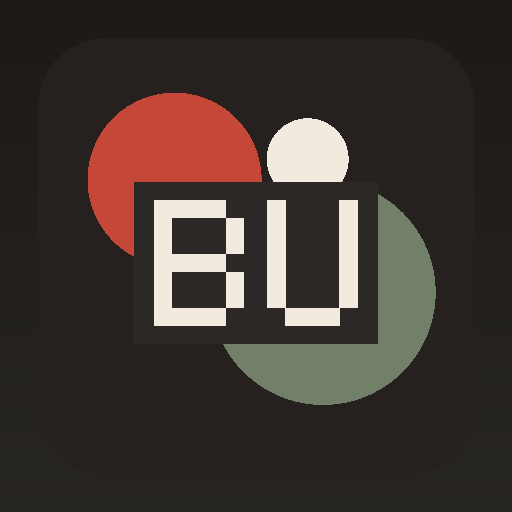

<h1 align="center">BURON</h1>

<strong>Designed for Everyday Identity.</strong>

A modern lifestyle brand focused on apparel, accessories, collections, and visual culture.

## What we focus on

- **Apparel** — Apparel is treated as part of the complete BURON experience — designed to clarify the system while keeping the experience clear, useful, and maintainable.
- **Accessories** — Accessories is treated as part of the complete BURON experience — designed to organize the system while keeping the experience clear, useful, and maintainable.
- **Collections** — Collections is treated as part of the complete BURON experience — designed to strengthen the system while keeping the experience clear, useful, and maintainable.
- **Essentials** — Essentials is treated as part of the complete BURON experience — designed to connect the system while keeping the experience clear, useful, and maintainable.
- **Editorial** — Editorial is treated as part of the complete BURON experience — designed to simplify the system while keeping the experience clear, useful, and maintainable.

## Explore

- 🌐 Website: https://buron-dk.github.io/
- 🧭 Brand repository: https://github.com/buron-dk/buron
- 🧱 Website source: https://github.com/buron-dk/buron-dk.github.io

## Support

- 🛟 Support Center: https://buron-dk.github.io/support.html

> Login email addresses are kept private and are not published automatically.

---

© 2026 BURON. All rights reserved.
